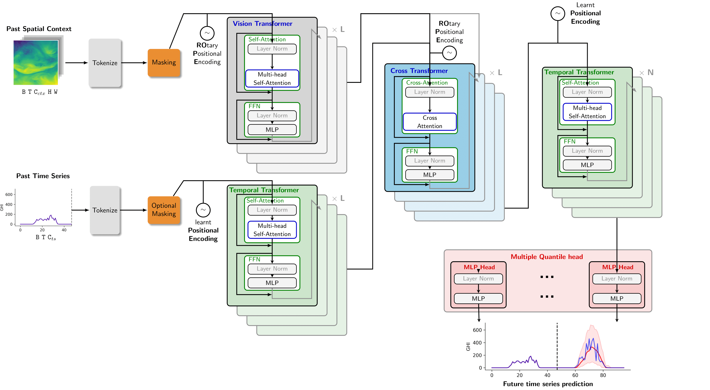

<div align="center">
  
# Improving day-ahead Solar Irradiance Time Series Forecasting by Leveraging Spatio-Temporal Context

[](https://github.com/pre-commit/pre-commit)
[](https://pytorch.org/get-started/locally/)
[](https://pytorchlightning.ai/)
[](https://hydra.cc/) 
[](https://github.com/gitbooo/TSF_context_Eumetsat/blob/neurips_2023/README.md#license)
 
</div>

## Description

This is the official repository to the paper ["What if We Enrich *day-ahead* Solar Irradiance Time Series Forecasting with Spatio-Temporal Context?"](https://arxiv.org/abs/2306.01112) by **Oussama Boussif**\*, **Ghait Boukachab**\*, **Dan Assouline**\*, Stefano Massaroli, Tianle Yuan and professors Loubna Benabbou and Yoshua Bengio.

(* equal contribution)

In this paper, we present a deep learning framework, [CrossViVit model](https://github.com/gitbooo/TSF_context_Eumetsat/blob/neurips_2023/src/models/cross_vivit_bis.py),  which leverages spatio-temporal context (e.g. satellite data) to improve the forecasting of solar irradiance at a particular meteorological station. In particular, CrossViViT exhibits zero-shot capabilities, generalizing well to unobserved solar stations.




https://github.com/gitbooo/CrossViVit/assets/12047248/95fd4b65-ce89-47e8-b987-bb73744498ec


## Citation
If you use this codebase, or otherwise found our work valuable, please cite CrossViVit

```
@article{boussif2023enrich,
  title   = {What if We Enrich day-ahead Solar Irradiance Time Series Forecasting with Spatio-Temporal Context?},
  author  = {Oussama Boussif and Ghait Boukachab and Dan Assouline and Stefano Massaroli and Tianle Yuan and Loubna Benabbou and Yoshua Bengio},
  year    = {2023},
  journal = {arXiv preprint arXiv: 2306.01112}
}
```

## Installation

#### Pip

```bash
# clone project
https://github.com/gitbooo/CrossViVit.git
cd CrossViVit

# [OPTIONAL] create conda environment
conda create -n myenv python=3.10
conda activate myenv

# install pytorch according to instructions
# https://pytorch.org/get-started/

# install requirements
pip install -r requirements.txt
```
## Experiments
To help the users reproduce our results, we released the sbatch scripts that we used. This scripts are suited for clusters with SLURM and everything should run without any errors. If you do encounter errors, then please open an issue !

 - CrossViViT large (145M): ``sbatch_scripts/crossvivit_large_rope.sh``
 - Multi-Quantile CrossViViT large (145.5M): ``sbatch_scripts/crossvivit_multiquantile_large.sh``
 - Multi-Quantile CrossViViT small (78.8M): ``sbatch_scripts/crossvivit_multiquantile_small.sh``
 - Time-Series baselines: Running ``sbatch_scripts/baselines.sh`` will launch an "array job" which effectively reads which baseline to run from ``sbatch_scripts/baselines.txt`` and schedules the jobs simultaneously.

## Hyperparameter tuning:
We use [orion](https://github.com/Epistimio/orion) to optimize hyperparameters and it's well suited for launching distributed hyperparameter optimization on clusters. It also integrates nicely with pytorch-lightning as well as hydra through their hydra plugin, so make sure to check their repo if you want more information !

You can launch the hyperparameter optimization using the following command:
```
CUDA_VISIBLE_DEVICES=0 python main.py -m hparams_search=[replace_with_model_to_be_tuned] experiment=[replace_with_model_to_be_tuned] seed=42 resume=True
```

We attached a sbatch script for optimizing CrossViViT's hyperparameters that you can find here: ``sbatch_scripts/crossvivit_tuning.sh``

## Baselines

In addition to the main contributions presented in the paper, this repository also includes the implementation of several baseline models. These baselines serve as reference models or starting points for comparison and evaluation.

The following baseline models are included:

  -  **DLinear** - Are Transformers Effective for Time Series Forecasting? [[AAAI 2023]](https://arxiv.org/pdf/2205.13504.pdf)
  -  **LightTS** - Less Is More: Fast Multivariate Time Series Forecasting with Light Sampling-oriented MLP Structures [[arXiv 2022]](https://arxiv.org/abs/2207.01186)
  -  **Informer** - Informer: Beyond Efficient Transformer for Long Sequence Time-Series Forecasting [[AAAI 2021]](https://arxiv.org/abs/2012.07436) 
  -  **Reformer** - Reformer: The Efficient Transformer [[ICLR 2020]](https://arxiv.org/abs/2001.04451)
  -  **Autoformer** - Autoformer: Decomposition Transformers with Auto-Correlation for Long-Term Series Forecasting [[NeurIPS 2021]](https://arxiv.org/abs/2106.13008)
  -  **FEDformer** - FEDformer: Frequency Enhanced Decomposed Transformer for Long-term Series Forecasting [[ICML 2022]](https://arxiv.org/abs/2201.12740) 
  -  **Crossformer** - Crossformer: Transformer Utilizing Cross-Dimension Dependency for Multivariate Time Series Forecasting [[ICLR 2023]](https://openreview.net/forum?id=vSVLM2j9eie)
  -  **PatchTST** - A Time Series is Worth 64 Words: Long-term Forecasting with Transformers. [[ICLR 2023]](https://arxiv.org/abs/2211.14730)
  -  **FiLM** - FiLM: Frequency improved Legendre Memory Model for Long-term Time Series Forecasting [[NeurIPS 2022]](https://arxiv.org/abs/2205.08897)
  
## License

CrossViVit is licensed under the MIT License.

```
MIT License

Copyright (c) 2021 ashleve

Permission is hereby granted, free of charge, to any person obtaining a copy
of this software and associated documentation files (the "Software"), to deal
in the Software without restriction, including without limitation the rights
to use, copy, modify, merge, publish, distribute, sublicense, and/or sell
copies of the Software, and to permit persons to whom the Software is
furnished to do so, subject to the following conditions:

The above copyright notice and this permission notice shall be included in all
copies or substantial portions of the Software.

THE SOFTWARE IS PROVIDED "AS IS", WITHOUT WARRANTY OF ANY KIND, EXPRESS OR
IMPLIED, INCLUDING BUT NOT LIMITED TO THE WARRANTIES OF MERCHANTABILITY,
FITNESS FOR A PARTICULAR PURPOSE AND NONINFRINGEMENT. IN NO EVENT SHALL THE
AUTHORS OR COPYRIGHT HOLDERS BE LIABLE FOR ANY CLAIM, DAMAGES OR OTHER
LIABILITY, WHETHER IN AN ACTION OF CONTRACT, TORT OR OTHERWISE, ARISING FROM,
OUT OF OR IN CONNECTION WITH THE SOFTWARE OR THE USE OR OTHER DEALINGS IN THE
SOFTWARE.
```
